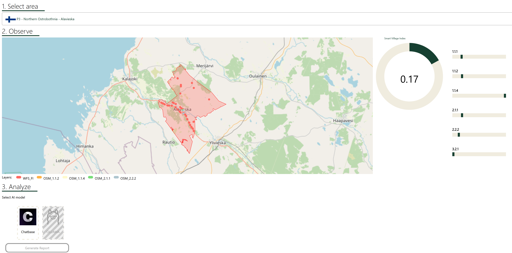
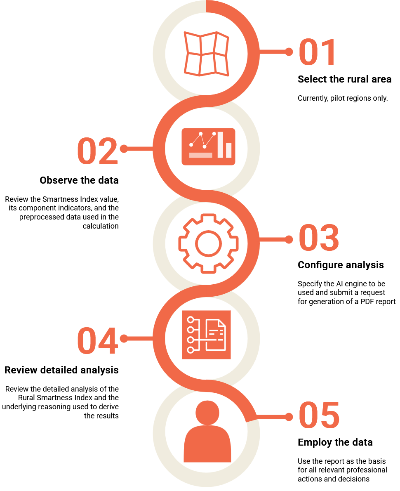

# AI-Assisted Framework for Rural Data Intelligence

# Deployed Demo
The most recent version of the framework is deployed under the following link

> [!WARNING]
> regional access restrictions may apply  

# Guideline

## Overview

Video demo of the framework functionality 🔗

# Source code  
To be published after refactoring.  

# Built with
## Dashboard

## Backend

